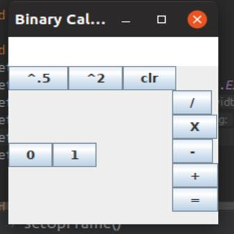

# BinaryCalculator
*Version 0.1*
*Working*
### Description
------
  This is a graphical bianary calculator that it does perform 
  * multiplication
  * addition
  * subtraction
  * division
  * square
  * square roots(rounded down to nearest integer)
    
### How To Use This Calculator
-------
    
  1. type any bianary number using the buttons provided
  2. select an operator
  3. type your second number
  4. hit the equals button provided
    
### Technical information
  Language java 
  Developed in intellij using jdk12  
### Task Distribution
* Mikey= Operators Class,repository setup 
* Kylie= GUI 
* Chris= InputInterpreter class, GUI 
